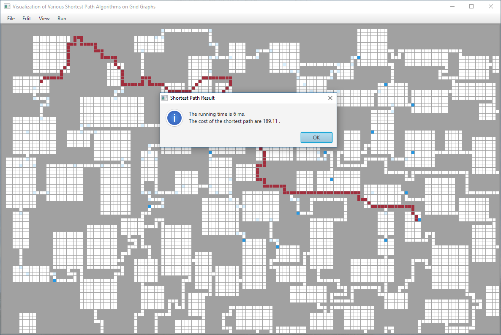
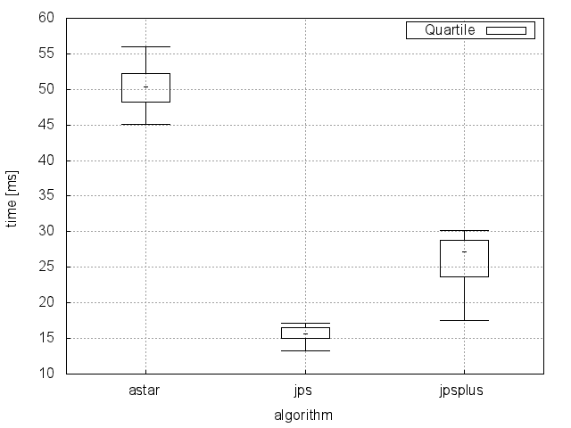
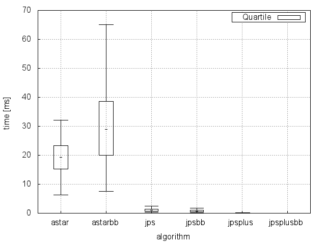
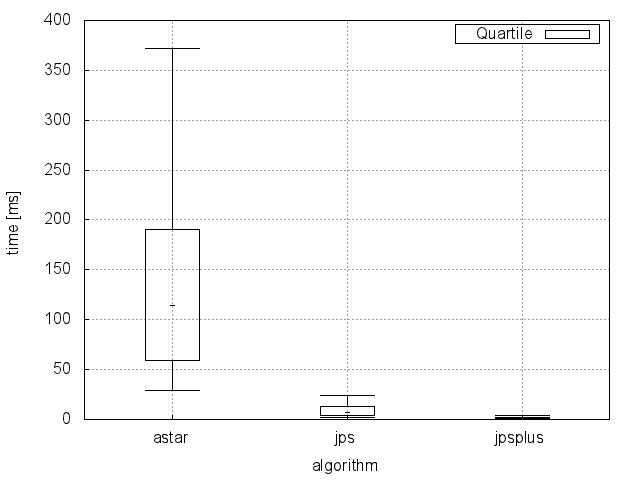

# Lab project: Efficient Algorithms for Selected Problems

Lab Efficient Algorithms for Selected Problems in summer term 2016 for University of Bonn.

We implemented and visualized the algorithm Jump Point Search. This algorithm is used for finding the shortest path in grid graphs.
The algorithm was presented first by Harabor and Grastien in papers "Online Graph Pruning for Pathfinding on Grid Maps" and "Improving Jump Point Search".
Further we implemented improvements to the algorithm, namely bouding boxes, by S. Rabin and N. Sturtevant by paper "Combining Bounding Boxes and JPS to Prune Grid Pathfinding".

The Java applet can be downloaded at [releases](https://github.com/drademacher/lab-jump-point-search/releases/latest). The applet visualizes the algorithm and is aimed to help understanding the algorithm behavior on various examples. These examples can be generated by random map generation or loading a map file from the repository. Any example can be modified to see how the algorithm reacts at different scenarios.

## Benchmarks

The algorithms which were compared in the benchmarks are the well-known [A*](https://en.wikipedia.org/wiki/A*_search_algorithm), Jump Point Serach (JPS), the improved version of Jump Point Search (JPSplus). At some maps we improved the runtime by using bounding boxes to prune the exanding possibilities. When the usage of bounding boxes was so small because of the map size, we omitted those benchmarks.

The benchmark map files can be found at the freely available pathfinding
library [Hierarchical Open Graph](https://github.com/nathansttt/hog2/tree/master/scenarios). The benchmarks show that our implementation of Jump Point Search clearly dominates A* in run time.

**Runtime on random maps:**

**Runtime on Baldurs Gate maps:**

**Runtime on Dragon Age maps:**

**Runtime on StarCraft maps:**

